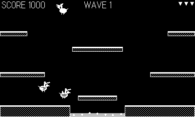

# Roost

> Part of **[plAIdate](https://plaidate.github.io)** — AI-built 1-bit games, ports, and engines for the Playdate.

A 1-bit aerial arcade game for the [Panic Playdate](https://play.date/):
flap to stay aloft, clash lances with rival fliers, and gather the eggs
before they hatch. Whoever's lance is higher at the moment of impact wins
the clash. An original take on the flap-to-fly flying-combat genre, with
fully procedural 1-bit art (no external image assets).



**New here?** Read the [player's manual](MANUAL.md) for the full rules,
scoring, enemy behaviour, and tips.

## Play it

Grab a prebuilt `Roost.pdx.zip` from the [Releases](../../releases) page (or
from `dist/`), then sideload it at <https://play.date/account/sideload/> — or
unzip it and open the `.pdx` in the Playdate Simulator. No dev toolchain
required.

## Controls

| Playdate | Action |
| --- | --- |
| d-pad left/right | steer |
| A **or** crank | flap |

## Enemies

Three tiers of rival fliers, faster and more aggressive as you climb:
**Fledgling** → **Harrier** → **Roc**.

## Build

Requires the [Playdate SDK](https://play.date/dev/) with `pdc` on `PATH`
(`SDK=…` if it isn't in `~/Developer/PlaydateSDK`).

```sh
make        # build Roost.pdx
make run    # build and open in the Playdate Simulator
make smoke  # instrumented build (autopilot + datastore heartbeat) for smoke tests
```

## License

MIT — see [LICENSE](LICENSE).
